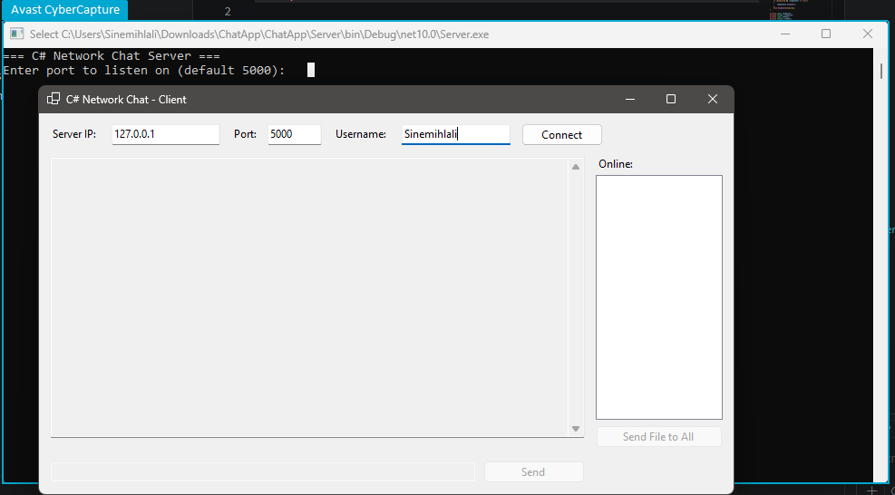
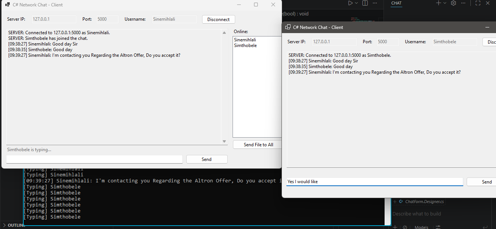
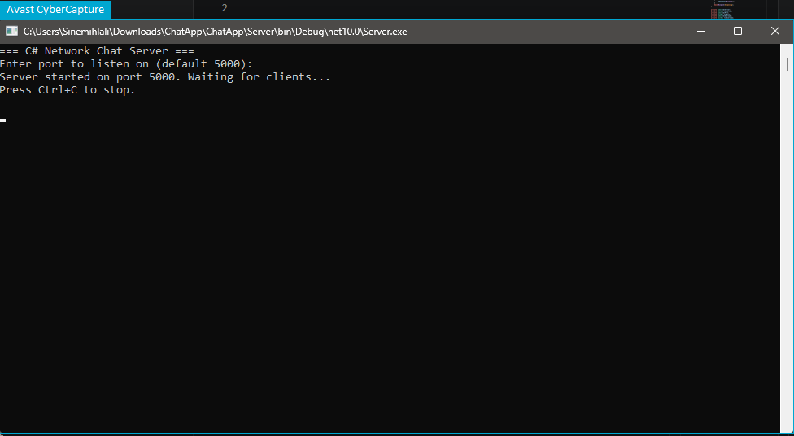
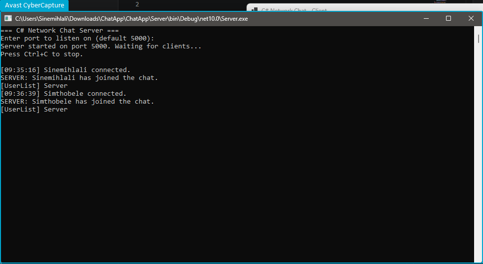
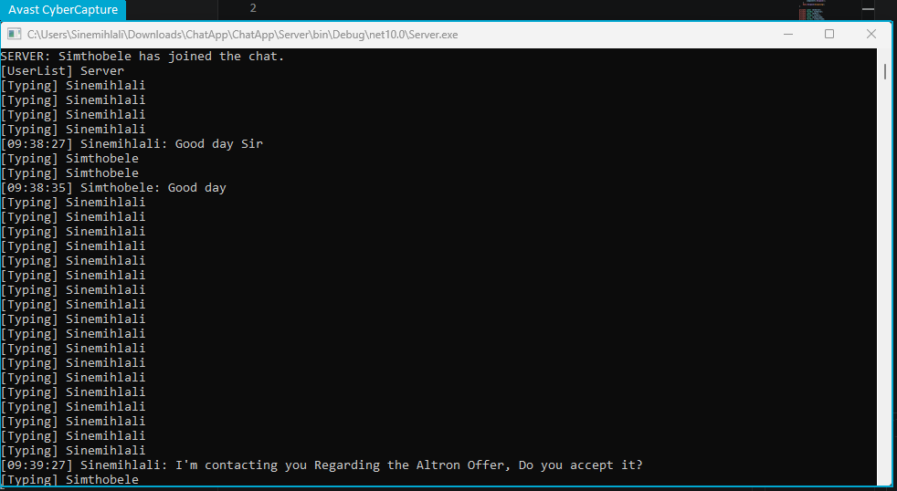
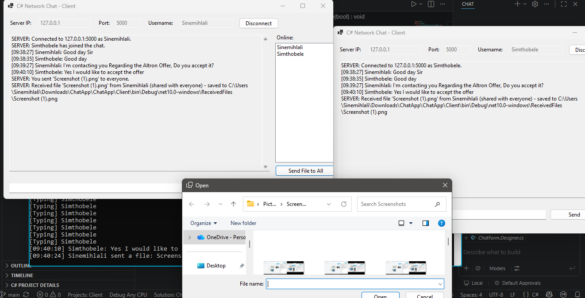

# C# Network Chat Application

A multi-client chat system built with C#, .NET, and TCP sockets. A console
**Server** accepts connections from any number of **Client** WinForms apps
on the same network, and coordinates broadcast chat, private messages,
file sharing, and message history between them over a JSON-based protocol.

## Screenshots

### Client connect screen


### Group chat with online users list


### Server console


### Server console with connected clients


### Typing indicator


### File sharing

## Project structure

```
ChatApp.sln
Shared/               Class library - the wire protocol, referenced by both projects
  ChatMessage.cs        The single message type sent over the socket (Chat, Dm, Typing, etc.)
  MessageSerializer.cs  Converts ChatMessage <-> JSON
Server/               Console app - TCP listener, routes and broadcasts messages
  Program.cs
  ChatServer.cs          Accepts connections, manages the client list, keeps chat history
  ClientHandler.cs        One instance per connected client; parses and routes its messages
Client/               WinForms app - the chat UI
  Program.cs
  ChatForm.cs             UI event handling
  ChatForm.Designer.cs    Control layout
  ChatClient.cs           TCP connection logic + auto-reconnect, kept separate from the UI
```

## Features

- **Group chat** - broadcast messages to everyone connected.
- **Private messaging** - type `/msg username your text`, or right-click a
  name in the Online list and choose **Direct Message** to pre-fill it.
- **Online users list** - updates live as people join and leave.
- **Typing indicator** - shows "X is typing..." under the chat box.
- **Message history** - new clients get the last 50 public chat messages
  on connect, so they're not dropped into a blank room.
- **File sharing** - the **Send File to All** button broadcasts a file to
  everyone; right-click a user and choose **Send File...** to send it to
  just them. Files are capped at 5 MB and saved into a `ReceivedFiles`
  folder next to the client executable.
- **Auto-reconnect** - if the connection drops unexpectedly, the client
  retries a few times with increasing delay before giving up and asking
  you to reconnect manually.

## How it works

- All communication uses a single `ChatMessage` class (in the **Shared**
  project) serialized to one line of JSON per message. A `Type` field
  (`Chat`, `Dm`, `Typing`, `UserList`, `History`, `File`, `Join`, `Leave`,
  `Error`) tells the receiver how to interpret the rest of the fields -
  this keeps Server and Client from drifting out of sync on the format.
- The **Server** opens a `TcpListener` and accepts clients in a loop. Each
  client gets its own `ClientHandler` running an independent async read
  loop, so multiple people can chat at once without blocking each other.
  `ChatServer` also tracks the last 50 public messages and the current
  list of usernames, and can route a message to a single user (for DMs
  and private file sends) or broadcast it to everyone.
- The **Client** connects with `TcpClient`, sends a `Join` message with
  its username, then sends/receives one JSON line per message. Incoming
  messages arrive on a background thread and are marshaled back to the UI
  thread with `Invoke` before touching any controls.

## Requirements

- .NET 10 SDK
- Visual Studio 2022+ (or VS Code) with the ".NET desktop development"
  workload for the WinForms client. The Server and Shared projects are
  plain .NET libraries and build anywhere .NET 10 runs.

## Running it

1. Open `ChatApp.sln`.
2. Run the **Server** project. It'll ask for a port, or press Enter for `5000`.
3. Run one or more instances of the **Client** project. Enter the server's
   IP (`127.0.0.1` if testing locally), the port, and a username, then
   click **Connect**.
4. Chat, DM, or send files between the open client windows.

To test over a real LAN, run the server on one machine, find its local IP
(`ipconfig` on Windows), and have other machines' clients connect to that
IP instead of `127.0.0.1`. Make sure the firewall allows the chosen port.

## Possible extensions

- TLS encryption over the socket (wrap the `NetworkStream` in `SslStream`)
- Persist chat history to a file or database instead of in-memory
- Read receipts / delivery confirmations
- Emoji reactions or markdown-style formatting in messages
